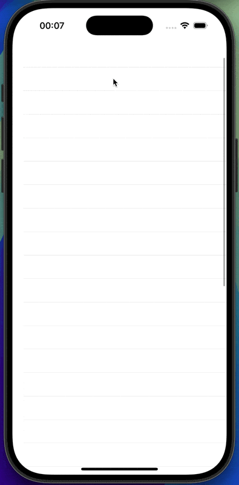

# MRefresh

[](https://travis-ci.org/Mikhail Rakhmanov/MRefresh)
[](http://cocoapods.org/pods/MRefresh)
[](http://cocoapods.org/pods/MRefresh)
[](http://cocoapods.org/pods/MRefresh)

## What is MRefresh

So basically MRefresh is a pull-to-refresh with a clear separation of concerns which consits of several independent components:
- a pull-to-refresh mechanism which adds a container view to a scrollview. This container view uses an animatable view conforming to *AnimatableViewConforming* protocol. The view receives messages during each of the pull-to-refresh stages (see description below),
- a path drawing mechanism which can read multiple SVG paths which are parts of one picture (*SVGConnectedPathFactory*), convert them to UIBezierPath objects, add additional points to such paths, so the drawing would be more smooth (using De Castelaju's Algorithm - https://en.wikipedia.org/wiki/De_Casteljau's_algorithm).

To sum up, you can:
- take *some* SVG paths (though as of today arc command has not been implemented, this requires some approximation of arcs using qubic curves and is trickier) and draw them in any combination when user pulls the scrollview,
- provide your own custom animations to the pull-to-refresh view

So here's a quick demo of what this library can do (we are drawing one of the FontAwesome SVG paths):



### Example

Below see the steps needed to configure the pull-to-refresh view. Of course, if you don't want to read the long description, you can download the example and see everything for yourself.

#### SVGConnectedPathFactory

The library was made in a way that enables you to configure all parameters of the pull-to-refresh process.

Firstly, you need SVG path, let it be something like this (it is a path that was taken from one of the FontAwesome icons, no copyrights infringed I hope): 

```swift
let path = "M1247 161q-5 154 -56 297.5t-139.5 260t-205 205t-260 139.5t-297.5 56q-14 1 -23 -9q-10 -10 -10 -23v-128q0 -13 9 -22t22 -10q204 -7 378 -111.5t278.5 -278.5t111.5 -378q1 -13 10 -22t22 -9h128q13 0 23 10q11 9 9 23"
```
Secondly, you need to create a svg path configuration, which provides additional parameters about how the path should be scaled.


```swift
var configuration = SVGConnectedPathConfiguration(size: size) 
```
Here you provide a *size* in which the path should be placed, basically the algorithm tries to center the path in the size so the path would take as much place as possible.

```swift
configuration.add(svg: path, startProportion: 0.0, depth: 2)
```
Here you add the part of the svg path to configuration.

*startProportion* says when during the pull to refresh process this path should start drawing. This is useful when you have multiple parts of the path to be able to start drawing them simultaneously or with some delay.

*depth* - how much you want your path to be smoothed (i.e. how many new points you want to be generated amount of points = initialSvgPoints * 2 ^ 3).

Then it is time to create the *SVGNode*'s through the *SVGConnectedPathFactory* which will do all the hard work converting and resizing your svg's.

```swift
let nodes = try SVGConnectedPathFactory.default.make(pathConfiguration: configuration)
```

#### PathDrawingAnimatableView

When you've done creating the path manager it is time to create the animatable view. You can do it like so:
```swift
let frame = CGRect(origin: CGPoint.zero,
                   size: size)
let animatableView = PathDrawingAnimatableView(path: connectedPath, frame: frame)
```
So *frame* is obviously the frame in which the view is drawn (actually the origin here doesn't matter because it is calculated under the hood).

#### Adding handler to a scroll view 

The very last thing is to add the animatable view, the configuration and the action handler (i.e. the closure which is called when the content offset reaches certain value) to a scroll view.

```swift
tableView.addPullToRefresh(animatable: animatableView, handler: { [weak self] in
    self?.somePresenter.didAskToRefreshAView()
})
...
// when the data was loaded
tableView.stopAnimating()
```

#### PullToRefreshConfiguration

You can specify additional parameters when adding view to scroll view as pull to refresh, see *PullToRefreshConfiguration*.

### Pull-to-refresh mechanism

Below see brief description of the pull-to-refresh mechanism. First of all, there is an extension to UIScrollView which enables you to add a view which conforms to a specific protocol *AnimatableViewConforming*. This view will receive certain messages from the UIScrollView when users pulls it and releases it. 

We can think of a pull-to-refresh as a 4 stage process.

#### First stage

The content offset of the scrollview hasn't reached some starting value (*startValue*) when the animatable view becomes visible.

#### Second stage

The content offset of the scrollview has reached the starting value, and the *AnimatableContainerView* (which is a container view used under the hood) tells your view to *drawPullToRefresh(proportion: CGFloat)*. The proportion will be a CGFloat value from 0 to 1 depending on whether the contentoffset has reached some other value, let's call it the *endValue*.

In case of *PathDrawingAnimatableView* which is a view conforming to  *AnimatableViewConforming* and is provided in the library, the proportion value will tell your view how many points in a path should be displayed on screen.

#### Third stage

The content offset of the scrollview has reached the *endValue*. Now:
- the view receives the *startAnimation* message,
- the scrollview's inset is increased to fit the animatable view with some additional space (== frame of the *AnimatableContainerView*),
- the actionHandler closure is called (e.g. some services shall start downloading something etc)

#### Fourth stage

The scrollview receives *stopAnimating* message (you should send the message when e.g. the data/error is received upon loading). After that if user is not holding the view with his finger, the view will receive *stopAnimation* message.

Please bear in mind the respective timing, because after user releases its finger the scrollview changes its insets to initial value.  

## Installation

MRefresh is available through [CocoaPods](http://cocoapods.org). To install
it, simply add the following line to your Podfile:

```ruby
pod 'MRefresh', '~> 0.2.1'
```
## Author

Mikhail Rakhmanov, rakhmanov.m@gmail.com

## License

MRefresh is available under the MIT license. See the LICENSE file for more info.
